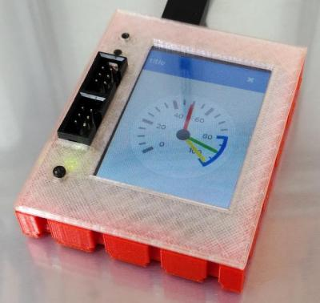
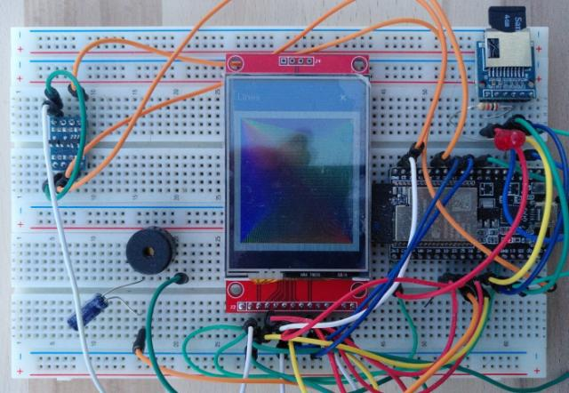

# ftDuino32 - ESP32 based blockly/python controller

This repository contains the code for the ftDuino32 controller.

## What is the ftDuino32?

The ftDuino32 controller is an ESP32 based controller with 240*320
touchscreen and SD card. It's meant to connect via I²C to an
[ftDuino](http://ftduino.de) allowing fischertechnik toy robots to
be programmed in Python and Blockly using nothing but a browser.

The ftDuino32 runs [Micropython](https://micropython.org/) and
[LVGL](https://lvgl.io/) allowing for touch based user interfaces
written in Python.


Furthermore the ftDuino includes a native web server with websocket
capabilities allowing to use the
[Blockly](https://developers.google.com/blockly) and
[CodeMirror](https://codemirror.net/) code editors. Finally a remote
view mirrors the device screen and allows to fully remote control the
touchscreen interface from the browser.

In the current state of the firmware it allows the user to:

- Setup WLAN using the touchscreen
- Run custom local Python apps from internal flash space or SD card
- Write Python programs using Blockly
- Write Python programs using CodeMirror
- Import/export/rename/delete/... programs
- Trigger program execution remotely
- Get a remote live view of the devices display



## Videos

- [Writing a Micropython app using Blockly](https://youtu.be/JS-Ef-26_-E)
- [Testing the remote GUI](https://www.youtube.com/watch?v=9zsAbTVxjMw)

## The hardware

The final device is planned to be sold fully assembled. But you can
run it on off-the-shelf breadboard components.

To run the ftDuino32 setup this way you need:

- ESP32 Wrover with PSRAM
- ILI9341 based 240*320 touch TFT
- optional SD card slot + SD card
- optional I2C level shifter to connect to ftDuino

The required wiring (VCC/GND is shared by the touch):

| ESP32 | TFT | TOUCH | SD card | Optional |
|-------|---|---|---|---|
| 3V3 | VCC | | VDD | |
| GND | GND | | VSS | |
| 5 | CS | | | |
| 27 | RESET | | | |
| 32 | DC | | | |
| 23 | SDI(MOSI) | T_DIN | | |
| 18 | SCK | T_CLK| | |
| 19 | SDO(MISO) | T_DO | | |
| 26 | | T_CS | | |
| 34 | | T_IRQ | | |
| 15 | | | CD_DAT3_CS | |
| 13 | | | CMD_DIN | |
| 14 | | | CLK | |
| 12 | | | DAT0_DO | |
| 35 | | | CD (optional) | |
| 2 | | | | LED green |
| 4 | | | | LED yellow |
| 25 | | | | Speaker |
| 21 | | | | I²C SDA to ftDuino |
| 22 | | | | I²C SCL to ftDuino |



## Firmware setup

This build has only been tested under Linux. These instuctions may
be outdated as MicroPython and LVGL are being developed rather quickly.

### Step 1: Install ESP-IDF

Clone the required 4.0 version of ESP-IDF.

```
git clone https://github.com/espressif/esp-idf.git
cd esp-idf
git checkout 4c81978a3e2220674a432a588292a4c860eef27b
git submodule update --init
```

Install the dependencies and install ESP-IDF:

```
cd esp-idf
python -m pip install --user -r ./requirements.txt
./install.sh
. ./export.sh
```

Apply [patch](https://github.com/harbaum/ftDuino32/tree/main/patches)
to add the latest http server including websocket support to the ESP-IDF 4.0:

```
cd esp-idf
patch -p1 < esp-idf.patch
```

### Step 2: Install Micropython

Clone Micropyton and install its dependencies:

```
sudo apt-get install build-essential libreadline-dev libffi-dev git pkg-config libsdl2-2.0-0 libsdl2-dev python3.8

git clone --recurse-submodules https://github.com/littlevgl/lv_micropython.git
```

Apply [patches](https://github.com/harbaum/ftDuino32/tree/main/patches):
```
cd lv_micropython
patch -p1 < http_server.patch
patch -p1 < lvgl.patch
patch -p1 < uzlib_compression.patch
```

This will add web server support to the micropythin bindings, increase
RAM access speed, add ftDuino32 LVGL theming, disable a few
unused things to save memory and add zlib/gzip compression to
Micropython.

### Step 3: Build and deploy micropython


```
cd lv_micropython
. ../esp-idf/export.sh
make -C mpy-cross
make -C ports/esp32 BOARD=GENERIC_SPIRAM deploy
```

This will result in the micropython firmware to be flashed to the
ESP32. You can connect a terminal program like picocom at 115200
bit/s to the board and watch it boot and use the REPL.

### Step 4: Populate embedded file system

In order to copy files into the micropython file system you need a
tool like [ampy](https://github.com/scientifichackers/ampy). You can
verify that ampy is working by entering e.g. ```ampy -p /dev/ttyUSB0
ls```. You omit to specify the device explicitely if you install an
environment variable like ```AMPY_PORT=/dev/ttyUSB0```.

If you are using a breadboard setup with an off-the-shelf TFT touchscnreen
you'll likely have to change init_gui_esp32 in [gui.py](firmware/gui.py) to
correct the screen colors and to ajust the touchscreen calibration:

```
    def init_gui_esp32(self):

        # Initialize ILI9341 display
        from ili9XXX import ili9341
 
        self.disp = ili9341(miso=19, mosi=23, clk=18, cs=5, dc=32, rst=27, spihost=1, power=-1, backlight=33, backlight_on=1, mhz=80, factor=4, double_buffer=True, hybrid=True, asynchronous=True, initialize=True)

        # Register xpt2046 touch driver
        from xpt2046 import xpt2046

        self.touch = xpt2046(cs=26, spihost=1, mhz=5, max_cmds=16, cal_x0 = 3783, cal_y0 = 3948, cal_x1 = 242, cal_y1 = 423, transpose = True, samples = 3)
```

Afterwards all files from [firmware](firmware/) need to be copied to
the internal flash. Additionally an /apps directory has to be created
to hold the user generated programs. You can optionally copy
[some example apps](apps/) there.

Finally the [html](html/) pages need to be copies to the internal flash
using the [install script](html/install.sh).

If everthing has been setup correctly the firmware will boot into a
user interface allowing it to be integrated into any WLAN which in turn
can be used to log into the ftDuino32 with a browser to write and run
custom Python applications.
