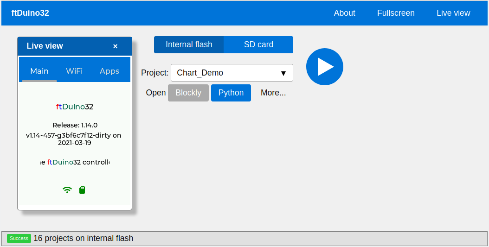

# ftDuino32 - ESP32 based blockly/python controller

This repository contains the code for the ftDuino32 controller.

## What is the ftDuino32?

The ftDuino32 controller is a ESP32 based controller with 240*320
touchscreen and SD card. It's meant to connect via I²C to an
[ftDuino](http://ftduino.de) allowing fischertechnik toy robots to
be programmed in Python and Blocmly using nothing but a browser.

The ftDuino32 runs [Micropython](https://micropython.org/) and
[LVGL](https://lvgl.io/) allowing for touch based user interfaces
written in Python.

Furthermore the ftDuino includes a native web server with websocket
capabilities allowing to use the
[Blockly](https://developers.google.com/blockly) and
[CodeMirror](https://codemirror.net/) code editors. Finally a remote
view allows to fully remote control the devices touchscreen interface
from the browser.

In the current state of the firmware it allows the user to:

- Setup WLAN using the touchscreen
- Run custom local Python apps from internal flash space or SD card
- Write Python programs using Blockly
- Write Python programs using CodeMirror
- Import/export/rename/delete/... programs
- Trigger program execution remotely
- Get a remote live view of the devices display

## Videos

- [Testing the remote GUI](https://www.youtube.com/watch?v=9zsAbTVxjMw)

## Get it running

To run the ftDuino32 setup you need:

- ESP32 Wrover with PSRAM
- ILI9341 based 240*320 touch TFT
- SD card slot + SD card

- Micropython with LVGL support
- ESP-IDF 4.0

Further patches provided in this repository are needed:

- [esp-idf.patch](patches/esp-idf.patch) to add the latest http server including websocket support to the ESP-IDF 4.0
- [http_server.patch](patches/http_server.patch) to add web server support to the micropythin bindings
- [lvgl.patch](patches/lvgl.patch) to increase RAM access speed, to add ftDuino32 LVGL theming and to disable a few unused things to save memory
- [uzlib_compression.patch](patches/uzlib_compression.patch) to add zlib/gzip compression to Micropython

The resulting micropython firmware needs to be flashed to the ESP32.

Afterwards all files from [firmware](firmware/) need to be copied to
the internal flash. A /apps directory has to be created to hold the user
generated programs.

Finally the [html](html/) pages need to be copies to the internal flash
using the [install script](html/install.sh).

If everthing has been setup correctly the firmware will boot into a
user interface allowing it to be integrated into any WLAN which in turn
can be used to log into the ftDuino32 with a browser to write and run
custom Python applications.
