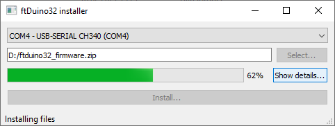

# ftDuino32 installer

The ftDuino32 installer provides an easy to use solution to install
Micropython and related files on an ESP32.

The ftDuino32 installer is written in Python and Qt and includes esptool
and ampy. For simplicity it can be compiled into a single binary e.g.
for Windows.

## For end users

As an end user you simply run the provided executable (e.g. a windows exe),
select the right COM port, select a ZIP file containing the firmware files
to install, click "Install..." and wait a few minutes for the installation
to succeed.

All you need is the [latest ZIP and EXE](https://github.com/harbaum/ftDuino32/releases/latest).

## For developers

As a developer you provide the ready-to-run windows executable
together with a prepared ZIP file. The zip file includes all the
required files together with a [config file](setup.json) that provides
additional information for the installation process.
